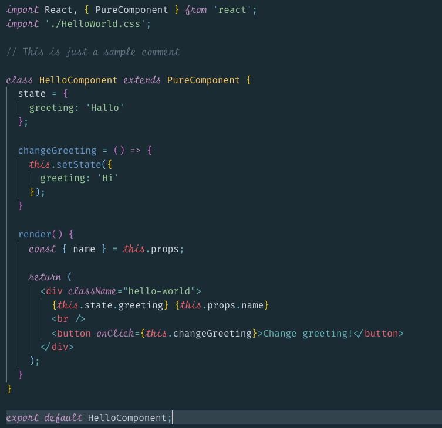

### 💅 Theme



- Install [Dark++ Italic](https://marketplace.visualstudio.com/items?itemName=idbartosz.darkpp-italic) theme and follow instructions to set up
- Use [Oceanic Next Italic](https://marketplace.visualstudio.com/items?itemName=SintrumIT.theme-oceanic-next-italic) instead
- Open `/Applications/Visual\ Studio\ Code.app/Contents/Resources/app/out/vs/workbench/workbench.main.css`
- Prepend CSS bellow right after the comment

```css
.mtki,.mtk13{font-style:italic;font-size:1.13em;font-stretch:ultra-condensed;}
```

- Restart VSCode dismissing the warning notification

