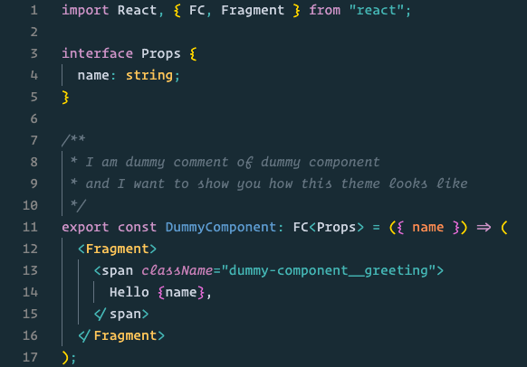
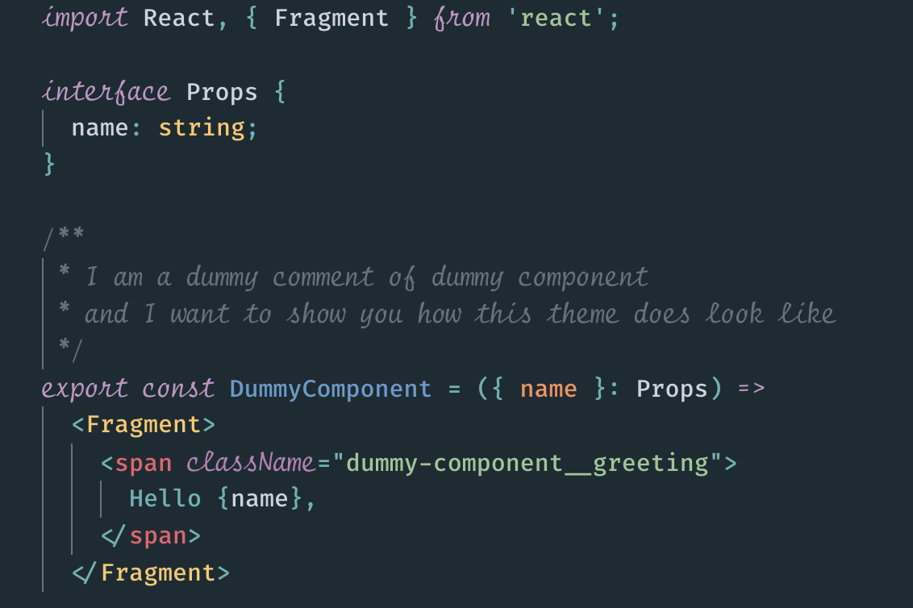

# 💅 Theme

## Operator Mono



#### Prerequisites

- 💶 &nbsp;[Operator Mono](https://www.typography.com/blog/introducing-operator) font

#### Setup

- Setup `Operator Mono Ligatures` according to the docs in [kiliman/operator-mono-lig](https://github.com/kiliman/operator-mono-lig) repository.
- Install and activate [Oceanic Next Italic](https://marketplace.visualstudio.com/items?itemName=SintrumIT.theme-oceanic-next-italic) theme
- Add the following properties into your `settings.json` file

```json
{
  "editor.fontFamily": "OperatorMonoLig-Book",
  "editor.fontWeight": "500",
  "editor.fontSize": 16,
  "editor.fontLigatures": true
}
```

## Fira Flott + Fira Code iScript Italic



#### Prerequisites

- [FiraFlott](<https://github.com/kosimst/FiraFlott/blob/master/TTF/FiraFlott%20FiraCode%20(Medium).ttf>) font
- [Fira Code iScript Italic](https://github.com/kencrocken/FiraCodeiScript/blob/master/FiraCodeiScript-Italic.ttf) font

#### Setup

- Install and activate [Oceanic Next Italic](https://marketplace.visualstudio.com/items?itemName=SintrumIT.theme-oceanic-next-italic) theme
- Add the following properties into your `settings.json` file

```json
{
  "editor.fontFamily": "FiraFlott",
  "editor.fontSize": 16,
  "editor.fontLigatures": true
}
```

Open workbench css file to customise it:

```sh
code /Applications/Visual\ Studio\ Code.app/Contents/Resources/app/out/vs/workbench/workbench.desktop.main.css
```

- Prepend CSS bellow right after the comment

```css
.mtki,
.mtk4,
.mtk13 {
  font-family: "Fira Code iScript";
  font-style: italic;
  font-size: 1.17em;
  font-stretch: ultra-condensed;
}
```

- Restart VSCode dismissing the warning about broken setup
